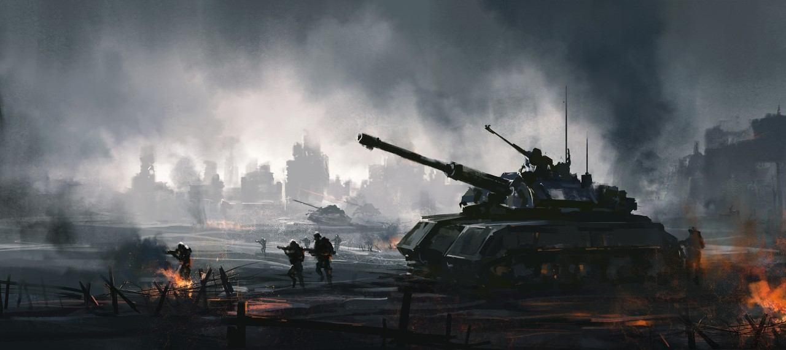

# 💣 Minesweeper Web Game

This is a browser-based implementation of the classic **Minesweeper** game built with vanilla JavaScript, HTML, and CSS. It offers a modern and responsive interface, difficulty selection, and in-game tips to assist new players.

## 🎮 Features

- Classic Minesweeper gameplay
- Dynamically generated game board
- Difficulty and grid size customization
- Interactive UI with in-game instructions
- Responsive design
- Restart and Home navigation buttons

## 🧠 How to Play

- **Left-click** to uncover a tile.
- **Middle-click** (mouse wheel) to flag a tile as potentially dangerous.
- The number on each tile indicates how many bombs are adjacent to it.
- Uncover all safe tiles to win!

## 📁 Project Structure

```
project-root/
├── index.html # Game configuration screen
├── game.html # Main game screen
├── assets/
│ ├── img/
│ │ └── battleground.jpg # Game background
│ ├── script/
│ │ └── script.js # Core game logic
│ └── style/
│ └── style.css # Game styling
```

## 🚀 Getting Started

1. Clone or download the repository.
2. Open `index.html` in a browser.
3. Choose your settings and click "Play Now" to start the game.

## 🛠️ Technologies Used

- HTML5
- CSS3
- JavaScript (ES6)

## 📷 Preview



## 📌 Future Improvements

- Timer and score tracking
- High score leaderboard
- Mobile-friendly enhancements
- Sound effects and animations

## 📄 License

This project is free to use and modify for personal or educational purposes.